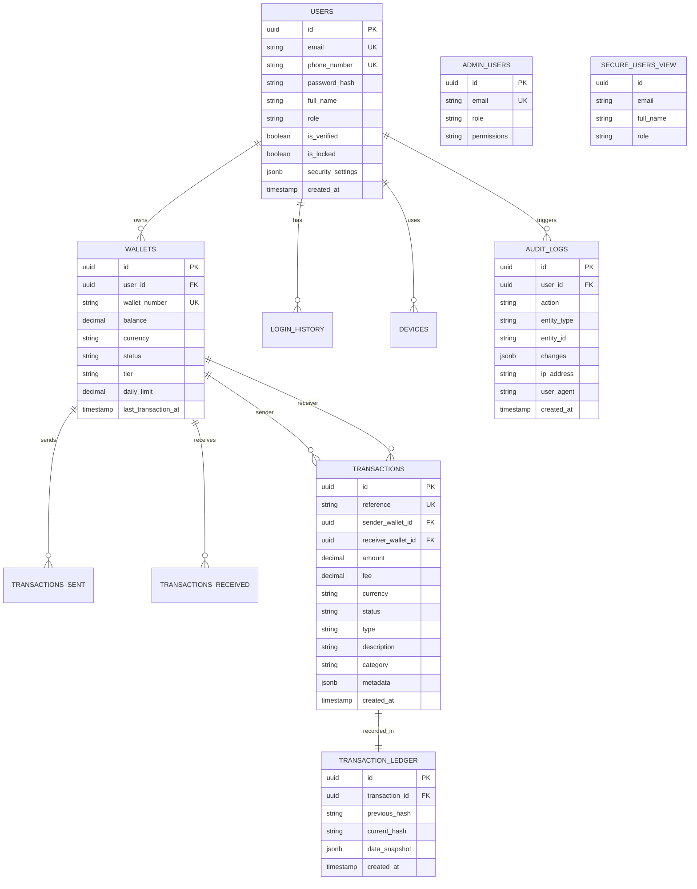

# Database Schema Documentation

## Entity Relationship Diagram (ERD)

This diagram represents the consolidated schema for the KYD Payment System.

## Schema Structure

### 1. Customer Schema (`customer_schema`)
Contains all user-facing data.
- **users**: Core user profiles with RLS enabled.
- **wallets**: Financial accounts associated with users.
- **transactions**: Financial records between wallets.
- **devices**: Trusted devices for 2FA/Security.

### 2. Admin Schema (`admin_schema`)
Contains internal administrative data.
- **admin_users**: Staff accounts with elevated privileges.
- **system_configs**: Global settings (fees, limits).

### 3. Audit Schema (`audit_schema`)
Immutable records for compliance and security.
- **audit_logs**: Tracks all critical user actions (password changes, login attempts).
- **transaction_ledger**: Hash-chained ledger for transaction immutability (Blockchain-like integrity).

## Security Features
- **Row Level Security (RLS)**: Enforced on all customer tables. Users can only see their own data.
- **Hash Chaining**: `transaction_ledger` ensures financial data cannot be tampered with without breaking the chain.
- **Encrypted Columns**: Sensitive fields (PII) are encrypted at rest using PGP.
