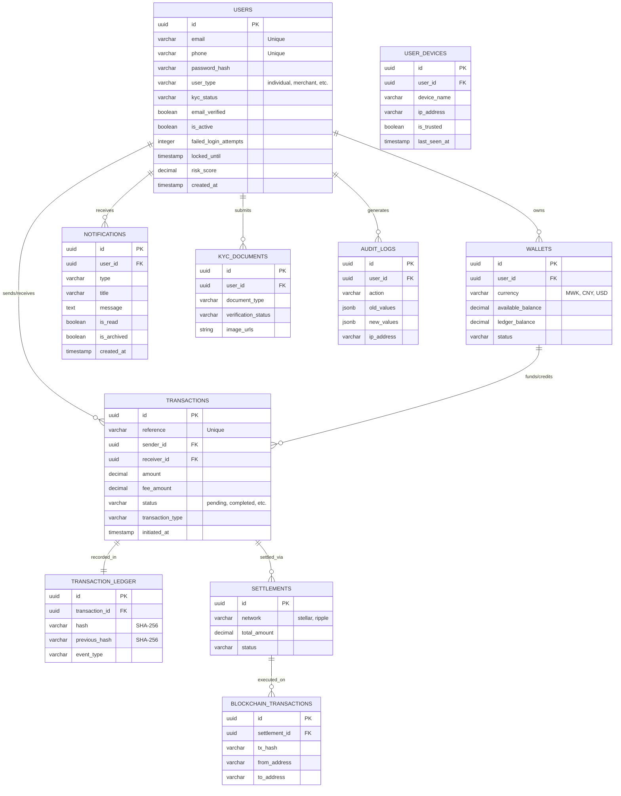

# Database Schema Documentation

## Entity Relationship Diagram (ERD)

The following diagram represents the consolidated schema for the VaultString Payment System.

## Schema Organization

The database is organized into schemas for security and logical separation:

1.  **customer_schema**: Contains core business data (Users, Wallets, Transactions, Notifications).
    *   **RLS (Row Level Security)** is enabled on all sensitive tables to ensure users can only access their own data.
2.  **admin_schema**: Contains high-level administrative logs (Audit Logs).
3.  **audit_schema**: Contains low-level data change logs (triggers capture every INSERT/UPDATE/DELETE).
4.  **privacy_schema**: Contains differential privacy budgets and query logs.

## Security Features

*   **Immutable Ledger**: `transaction_ledger` uses a SHA-256 hash chain (`previous_hash` -> `hash`) to prevent tampering with transaction history.
*   **Audit Logging**: Triggers automatically log all data changes to `audit_schema.data_changes`.
*   **Roles**: `kyd_system` (app backend) and `kyd_admin` (DBA/admin tool) roles are defined with least-privilege access.
